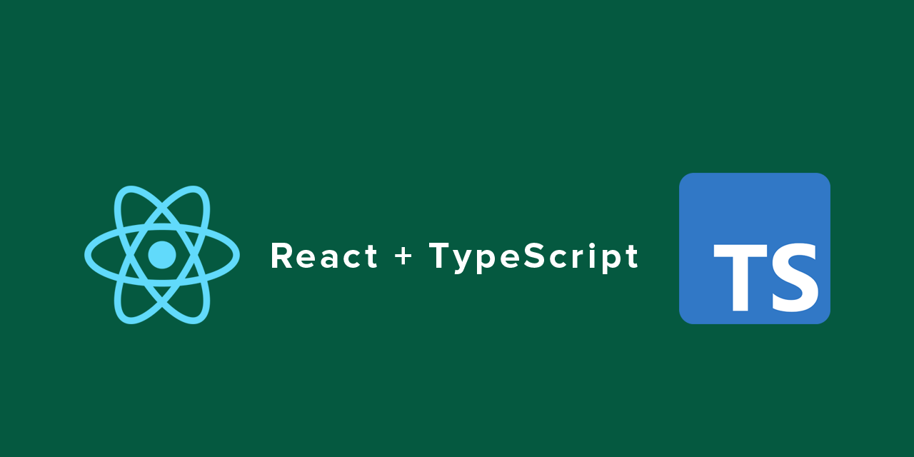

# React Learning 

# İçindekiler
- [React Learning](#react-learning-)
- [İçindekiler](#içindekiler)
- [React Learning Hakkında](#react-learning-hakkında)
- [Referans](#referans)

# React Learning Hakkında

Bu repoda React bilgilerimi tekrar ederken  aldığım notlar ve çalışmalar paylaşılacaktır. Bu repoda React bilgilerimi pekiştirirken TypeScript bilgilerimi de React çalışmalarından kullanacağımdan TypeScript ile alakalı takıldığınız alanda Learn TypeScript  reposundan da faydanalanabilirsiniz.

İlgili konuyla yazılmış kodlara Egzersizler adlı klasörden ulaşabilirsiniz.

# Referans
- [Learn TypeScript Repo](https://github.com/MelihKrts/Learn-TypeScript)